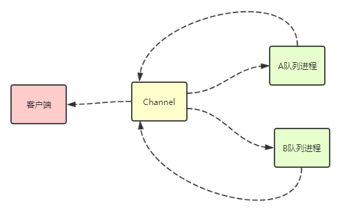

# 确认机制

在以前章节中，我们说到过写消息的时候 数据是先到 reader 进程再到channel 进程再，再由channel进程分发给队列进程。

==rabbitmq 本身提供了confirm机制，但rabbitmq服务端在什么时候返回confirm信息给客户端呢？==

> 有以下几种可能.
> 
> 1. channel进程一拿到消息后就返回confirm给客户端，那这样不就会丢消息？
> 2. 队列进程一拿到消息就返回给客户端，那路由到多个队列的时候 怎么办呢？
> 3. 队列写到了磁盘的时候再返回给客户端？


#### 从源码来分析流程

##### 1. channel通道拿到消息之后，去mnesia 数据库通过exchange和routingkey 找到所绑定的队列的qids。然后通过 delegate:cast 下发消息给队列进程


```
deliver_to_queues({Delivery = #delivery{message    = Message = #basic_message{
                                                       exchange_name = XName},
                                        mandatory  = Mandatory,
                                        confirm    = Confirm,
                                        msg_seq_no = MsgSeqNo},
                   DelQNames}, State = #ch{queue_names    = QNames,
                                           queue_monitors = QMons}) ->
    Qs = rabbit_amqqueue:lookup(DelQNames),
    DeliveredQPids = rabbit_amqqueue:deliver(Qs, Delivery),
    %% The pmon:monitor_all/2 monitors all queues to which we
    %% delivered. But we want to monitor even queues we didn't deliver
    %% to, since we need their 'DOWN' messages to clean
    %% queue_names. So we also need to monitor each QPid from
    %% queues. But that only gets the masters (which is fine for
    %% cleaning queue_names), so we need the union of both.
    %%
    %% ...and we need to add even non-delivered queues to queue_names
    %% since alternative algorithms to update queue_names less
    %% frequently would in fact be more expensive in the common case.
    {QNames1, QMons1} =
        lists:foldl(fun (#amqqueue{pid = QPid, name = QName},
                         {QNames0, QMons0}) ->
                            {case dict:is_key(QPid, QNames0) of
                                 true  -> QNames0;
                                 false -> dict:store(QPid, QName, QNames0)
                             end, pmon:monitor(QPid, QMons0)}
                    end, {QNames, pmon:monitor_all(DeliveredQPids, QMons)}, Qs),
    State1 = State#ch{queue_names    = QNames1,
                      queue_monitors = QMons1},
    %% NB: the order here is important since basic.returns must be
    %% sent before confirms.
    State2 = process_routing_mandatory(Mandatory, DeliveredQPids, MsgSeqNo,
                                       Message, State1),
    State3 = process_routing_confirm(  Confirm,   DeliveredQPids, MsgSeqNo,
                                       XName,   State2),
    ?INCR_STATS([{exchange_stats, XName, 1} |
                 [{queue_exchange_stats, {QName, XName}, 1} ||
                     QPid        <- DeliveredQPids,
                     {ok, QName} <- [dict:find(QPid, QNames1)]]],
                publish, State3),
    State3.
```

##### 2. 如果上面没有找到绑定的队列，则会进行返回没有找到队列的信息给客户端。

所以 客户端 mandatory = true 的时候，是在channel层来决定是否返回有没找到路由信息的。如果找到了，并不会返回任何信息。

```
process_routing_mandatory(false,     _, _MsgSeqNo, _Msg, State) ->
    State;
process_routing_mandatory(true,     [], _MsgSeqNo,  Msg, State) ->
    ok = basic_return(Msg, State, no_route),
    State;
process_routing_mandatory(true,  QPids,  MsgSeqNo,  Msg, State) ->
    State#ch{mandatory = dtree:insert(MsgSeqNo, QPids, Msg,
                                      State#ch.mandatory)}.
```


##### 3. Channel进程判断一下是否要返回confirm信息给客户端

备：rabbit_log:print 为个人添加的打印日志的函数，以下类同


```
process_routing_confirm(false,    _, _MsgSeqNo, _XName, State) ->
    State;
process_routing_confirm(true,    [],  MsgSeqNo,  XName, State) ->
    rabbit_log:print("channel process_routing_confirm confirm true MsgSeqNo:~p ~n",[MsgSeqNo]),
    record_confirms([{MsgSeqNo, XName}], State);
process_routing_confirm(true, QPids,  MsgSeqNo,  XName, State) ->
    rabbit_log:print("channel process_routing_confirm confirm true QPids:~p MsgSeqNo:~p ~n",[QPids,MsgSeqNo]),
    State1 = State#ch{unconfirmed = dtree:insert(MsgSeqNo, QPids, XName,
                                        State#ch.unconfirmed)},
    rabbit_log:print("channel process_routing_confirm confirm confirmed:~p, unconfirmed:~p ~n",[State1#ch.confirmed,State1#ch.unconfirmed]),
    State1.
```

==如果客户端设置了需要confirm信息，并且找到了队列的情况下，则将当前消息的编号（记住这只是编号，相对于每个channel来说每条消息都会自动+1）及队列进程PID 进行保存在unconfirm变量中。==

反之没有找到队列进程则直接就返回confirm消息给客户端。

##### 4. 队列进程拿到消息


```
deliver_or_enqueue(Delivery = #delivery{message = Message,
                                        sender  = SenderPid,
                                        flow    = Flow},
                   Delivered, State = #q{backing_queue       = BQ,
                                         backing_queue_state = BQS}) ->
    send_mandatory(Delivery), %% must do this before confirms
    {Confirm, State1} = send_or_record_confirm(Delivery, State),
    Props = message_properties(Message, Confirm, State1),
    {IsDuplicate, BQS1} = BQ:is_duplicate(Message, BQS),
    State2 = State1#q{backing_queue_state = BQS1},
```


##### 5. 队列进程首先判断是否要立刻返回消息给channel 进程


```
send_or_record_confirm(#delivery{confirm    = false}, State) ->
    {never, State};
send_or_record_confirm(#delivery{confirm    = true,
                                 sender     = SenderPid,
                                 msg_seq_no = MsgSeqNo,
                                 message    = #basic_message {
                                   is_persistent = true,
                                   id            = MsgId}},
                       State = #q{q                 = #amqqueue{durable = true},
                                  msg_id_to_channel = MTC}) ->
    MTC1 = gb_trees:insert(MsgId, {SenderPid, MsgSeqNo}, MTC),
    {eventually, State#q{msg_id_to_channel = MTC1}};
send_or_record_confirm(#delivery{confirm    = true,
                                 sender     = SenderPid,
                                 msg_seq_no = MsgSeqNo}, State) ->
    rabbit_misc:confirm_to_sender(SenderPid, [MsgSeqNo]),
    {immediately, State}.
```


==假如消息为持久化数据，则将消息编号及Channel的PID保存到  msg_id_to_channel 变量中，待后面使用==

==否则直接返回给channel进程==

返回channel 进程的消息函数代码如下：

```
gen_server2:cast(Pid, {confirm, MsgSeqNos, self()}).
```


##### 6. 队列进程消息分配给在线的消费或者写入到磁盘

这个过程请参数 写入过程-概要 及 写入过程-索引持久化  


##### 7. 队列进程返回确认信息给Channel进程 

在执行完了  deliver_to_queues 过程之后，立即执行 noreply 函数，这个函数里会再次执行 next_state函数，在next_state 函数里再次执行  ==confirm_messages 函数函，将 上面保存的 msg_id_to_channel 变量里的数据，清除掉并且返回给Channel进程confirm消息==


```
confirm_messages([], MTC) ->
    MTC;
confirm_messages(MsgIds, MTC) ->
    {CMs, MTC1} =
        lists:foldl(
          fun(MsgId, {CMs, MTC0}) ->
                  case gb_trees:lookup(MsgId, MTC0) of
                      {value, {SenderPid, MsgSeqNo}} ->
                          {rabbit_misc:gb_trees_cons(SenderPid,
                                                     MsgSeqNo, CMs),
                           gb_trees:delete(MsgId, MTC0)};
                      none ->
                          {CMs, MTC0}
                  end
          end, {gb_trees:empty(), MTC}, MsgIds),
    rabbit_misc:gb_trees_foreach(fun rabbit_misc:confirm_to_sender/2, CMs),
    MTC1.

confirm_to_sender(Pid, MsgSeqNos) ->
    gen_server2:cast(Pid, {confirm, MsgSeqNos, self()}).
```


##### 8. Channel 通道进程接收到队列进程返回的confirm指令，再返回给confirm消息给客户端


```
handle_cast({confirm, MsgSeqNos, QPid}, State = #ch{unconfirmed = UC}) ->
    rabbit_log:print("channel handle_cast confirm MsgSeqNos:~p , confirm:~p unconfirmed:~p ~n",[MsgSeqNos,State#ch.confirmed,UC]),
    {MXs, UC1} = dtree:take(MsgSeqNos, QPid, UC),
    %% NB: don't call noreply/1 since we don't want to send confirms.
    rabbit_log:print("channel handle_cast confirm record_confirms start ~p ~n",[?MODULE]),
    Data = record_confirms(MXs, State#ch{unconfirmed = UC1}),
    rabbit_log:print("channel handle_cast confirm record_confirms over ~p ~n",[?MODULE]),
    noreply_coalesce(Data).
```


==Channel 接收到指令，则从 unconfirmed 中删除掉相关队列进程与当前消息编号的关系，直接到这个消息所有进程都返回confirm消息了，再挪到 confirm 变量中去==

在这个回调方法里 返回 {noreply,State,Timeout} 数据格式，进行再次回调 noreply 方法 执行 next_state方法，再由next_state方法执行 send_confirms 方法将confirm变量中的消息进行返回confirm消息给客户端


```
noreply(NewState) ->
  rabbit_log:print("channel noreply ~n"),
  {noreply, next_state(NewState), hibernate}.
  
next_state(State) -> ensure_stats_timer(send_confirms(State)).

send_confirms(State = #ch{tx = none, confirmed = C}) ->
    rabbit_log:print("channel send_confirms confirmed:~p unconfirmed:~p ~n",[C,State#ch.unconfirmed]),
    case rabbit_node_monitor:pause_partition_guard() of
        ok      -> MsgSeqNos =
                       lists:foldl(
                         fun ({MsgSeqNo, XName}, MSNs) ->
                                 ?INCR_STATS([{exchange_stats, XName, 1}],
                                             confirm, State),
                                 [MsgSeqNo | MSNs]
                         end, [], lists:append(C)),
                   send_confirms(MsgSeqNos, State#ch{confirmed = []});
        pausing -> State
    end;
```


**打印的执行的流水日志：**


```
PID:<0.563.0> Time: 2019:3:4 19:14:2 
------*process_frame ,Method:{'basic.publish',0,<<"amq.direct">>,
                                 <<"testQueue">>,true,false} : NewAState: {method,
                                                                           rabbit_framing_amqp_0_9_1}
PID:<0.572.0> Time: 2019:3:4 19:14:2 
channel Method:{'basic.publish',0,<<"amq.direct">>,<<"testQueue">>,true,false}, Flow:flow Content:{content,
                                                                                                   60,
                                                                                                   none,
                                                                                                   <<144,0,
                                                                                                     10,116,
                                                                                                     101,120,
                                                                                                     116,47,
                                                                                                     112,108,
                                                                                                     97,105,
                                                                                                     110,2>>,
                                                                                                   rabbit_framing_amqp_0_9_1,
                                                                                                   [<<1,1>>]} 
PID:<0.572.0> Time: 2019:3:4 19:14:2 
channel start deliver_to_queues QID:<0.572.0> 
PID:<0.572.0> Time: 2019:3:4 19:14:2 
channel process_routing_confirm confirm true QPids:[<0.259.0>] MsgSeqNo:1 
PID:<0.572.0> Time: 2019:3:4 19:14:2 
channel process_routing_confirm confirm confirmed:[], unconfirmed:{ {1,
                                                                    {1,
                                                                     { {1,
                                                                       {<0.259.0>,
                                                                        nil,
                                                                        nil}},
                                                                      {resource,
                                                                       <<"testvhost">>,
                                                                       exchange,
                                                                       <<"amq.direct">>}},
                                                                     nil,nil}},
                                                                   {1,
                                                                    {<0.259.0>,
                                                                     {1,
                                                                      {1,nil,
                                                                       nil}},
                                                                     nil,
                                                                     nil}}} 
PID:<0.572.0> Time: 2019:3:4 19:14:2 
channel over deliver_to_queues QID:<0.572.0> 
PID:<0.572.0> Time: 2019:3:4 19:14:2 
channel noreply 
PID:<0.572.0> Time: 2019:3:4 19:14:2 
channel handle_cast mandatory_received MsgSeqNos:1  
PID:<0.572.0> Time: 2019:3:4 19:14:2 
channel noreply_coalesce start 
PID:<0.572.0> Time: 2019:3:4 19:14:2 
channel noreply_coalesce over 
PID:<0.572.0> Time: 2019:3:4 19:14:2 
channel handle_cast confirm MsgSeqNos:[1] , confirm:[] unconfirmed:{ {1,
                                                                     {1,
                                                                      { {1,
                                                                        {<0.259.0>,
                                                                         nil,
                                                                         nil}},
                                                                       {resource,
                                                                        <<"testvhost">>,
                                                                        exchange,
                                                                        <<"amq.direct">>}},
                                                                      nil,
                                                                      nil}},
                                                                    {1,
                                                                     {<0.259.0>,
                                                                      {1,
                                                                       {1,nil,
                                                                        nil}},
                                                                      nil,
                                                                      nil}}} 
PID:<0.572.0> Time: 2019:3:4 19:14:2 
channel handle_cast confirm record_confirms start rabbit_channel 
PID:<0.572.0> Time: 2019:3:4 19:14:2 
channel handle_cast confirm record_confirms over rabbit_channel 
PID:<0.572.0> Time: 2019:3:4 19:14:2 
channel noreply_coalesce start 
PID:<0.572.0> Time: 2019:3:4 19:14:2 
channel noreply_coalesce over 
PID:<0.572.0> Time: 2019:3:4 19:14:2 
channel noreply 
PID:<0.572.0> Time: 2019:3:4 19:14:2 
channel send_confirms confirmed:[[{1,
                                   {resource,<<"testvhost">>,exchange,
                                       <<"amq.direct">>}}]] unconfirmed:{ {0,
                                                                          nil},
                                                                         {0,
                                                                          nil}}
```


##### 整个流程图大概如下：





#### 小结

RabbitMQ 客户端confirm机制的开启，如果消息是非持久化的情况下，数据到了队列进程就立马返回。

反之为持久化消息的情况下，是写到了磁盘（这是RabbitMQ官方的说法，其实这个地方并不能保存一定到了磁盘，只是保证到了linux内核，如果内核不宕机等情况下，是不会丢数据）中再返回成功。

但是如果提交的exchange及routingkey 没有匹配到队列也一样会返回confirm消息给客户端。

==所以如果一定要确保数据到达了队列，请开启 mandatory 机制。==

==mandatory 只有在没有找到队列的时候，会返回错误信息，否则不会返回。==
