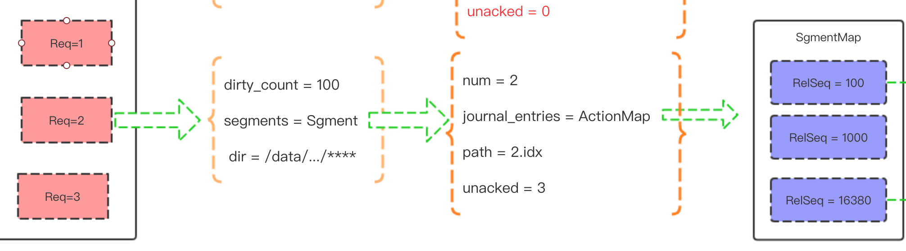

# 数据恢复

正常情况我们重启都是安全关闭应用之后,再进行重启的情况下,进程是通过kill -15 信号进行关闭应用的.

kill -15 信号进程可以接收到信息,然后再把数据刷盘磁盘后再停应用

但是kill -9 或者断电及linux内核宕机的时候
,进程是接收不到信号回调的.这个时候为了保证数据安全是比较困难的.

RabbitMQ对以上两种情况,数据恢复原理是不一样的


#### 恢复过程

##### 1. 安全关闭并重启的情况下

在执行命令


```
rabbitctl app_stop
```


或者


```
rabbitmq-server stop
```


会把当前索引文件的信息(包括unack的数量等)写入到当前队列所在文件夹下 recovery.dets 文件

==recovery.dets 文件里存的是每个索引文件的基本信息==



源码：


```
terminate(Terms, State = #qistate { dir = Dir }) ->
 {SegmentCounts, State1} = terminate(State),
 %% 将需要恢复的信息存储到恢复文件中(recovery.dets DETS的ETS类型)，等到RabbitMQ系统重启的时候，每个持久化的消息队列会从这个DETS中获取数据恢复队列
 rabbit_recovery_terms:store(filename:basename(Dir),
        [{segments, SegmentCounts} | Terms]),
 State1.
```


在执行命令


```
rabbitctl app_start
```


或者


```
rabbitmq-server start
```


###### 1). 队列进程启动的时候,首先加载 文件 recovery.dets ,转成在上一次停止应用之前的内存结构.这个内存结构参数消息写入过程章节

###### 2). 加载 journal.jif

  在每次写入的时候,持久化的数据,最先就是往journal.jif
  文件刷写数据,在后面数据完全落盘等情况下再清空这个文件.
  
 现在重启的时候 ,会去加载这个文件,目的就是防止在某些情况下数据还没落盘的时候 ,我们就把应用给停了等情况下.可以从这个文件里重新加载.
 
 接着可以重启之前的操作.进行重做刷盘事件
 
###### 3). 再从磁盘中加载数据到队列的Q3 List. 


#### 2. 非法重启的情况

#####  1).  非法关闭应用的情况下重启 比较复杂,没有recovery.dets 文件,也没有了索引信息.
 
 这个时候 只有把当前队列文件夹下所有*.idx
 
 ==索引文件进行遍历并打开,一个一个文件进行读取进行 segment 文件索引信息恢复 . 
 这里只是恢复 索引文件的一些信息,并不是队列里的Q1.Q2.Q3.Q4那几个list的数据==
 
  在rabbitmq里读取文件是一下子读取整个文件进来,然后按着规则匹配数据,并不是像其他 mysql binlog那样,第几个字符存的是接下来内容是什么,及长度等等
  

```
%% 解析从操作项磁盘文件中读取的二进制文件，将二进制文件转化为内存中的数据结构
%% 操作项实体的解析
parse_segment_entries(<<?PUB_PREFIX:?PUB_PREFIX_BITS,
      IsPersistNum:1, RelSeq:?REL_SEQ_BITS, Rest/binary>>,
      KeepAcked, Acc) ->
 parse_segment_publish_entry(
       Rest, 1 == IsPersistNum, RelSeq, KeepAcked, Acc);

%% del和ack操作的解析
parse_segment_entries(<<?REL_SEQ_ONLY_PREFIX:?REL_SEQ_ONLY_PREFIX_BITS,
      RelSeq:?REL_SEQ_BITS, Rest/binary>>, KeepAcked, Acc) ->
 parse_segment_entries(
      Rest, KeepAcked, add_segment_relseq_entry(KeepAcked, RelSeq, Acc));

parse_segment_entries(<<>>, _KeepAcked, Acc) ->
 Acc.


%% 从二进制流中解析出操作项数据
parse_segment_publish_entry(<<Bin:?PUB_RECORD_BODY_BYTES/binary,
                              MsgSize:?EMBEDDED_SIZE_BITS,
                              MsgBin:MsgSize/binary, Rest/binary>>,
                            IsPersistent, RelSeq, KeepAcked,
                            {SegEntries, Unacked}) ->
 %% 组装好内存中的操作项信息
    Obj = { {IsPersistent, Bin, MsgBin}, no_del, no_ack},
    SegEntries1 = array:set(RelSeq, Obj, SegEntries),
    parse_segment_entries(Rest, KeepAcked, {SegEntries1, Unacked + 1});

parse_segment_publish_entry(Rest, _IsPersistent, _RelSeq, KeepAcked, Acc) ->
    parse_segment_entries(Rest, KeepAcked, Acc).


%% 组装删除和确认的操作项(该信息都是放在操作项实际信息的后面)
add_segment_relseq_entry(KeepAcked, RelSeq, {SegEntries, Unacked}) ->
 case array:get(RelSeq, SegEntries) of
  {Pub, no_del, no_ack} ->
   {array:set(RelSeq, {Pub, del, no_ack}, SegEntries), Unacked};
  {Pub, del, no_ack} when KeepAcked ->
   {array:set(RelSeq, {Pub, del, ack},    SegEntries), Unacked - 1};
  {_Pub, del, no_ack} ->
   {array:reset(RelSeq,                   SegEntries), Unacked - 1}
 end.
```


##### 2). 再从磁盘中加载数据到队列的Q3 List. 
